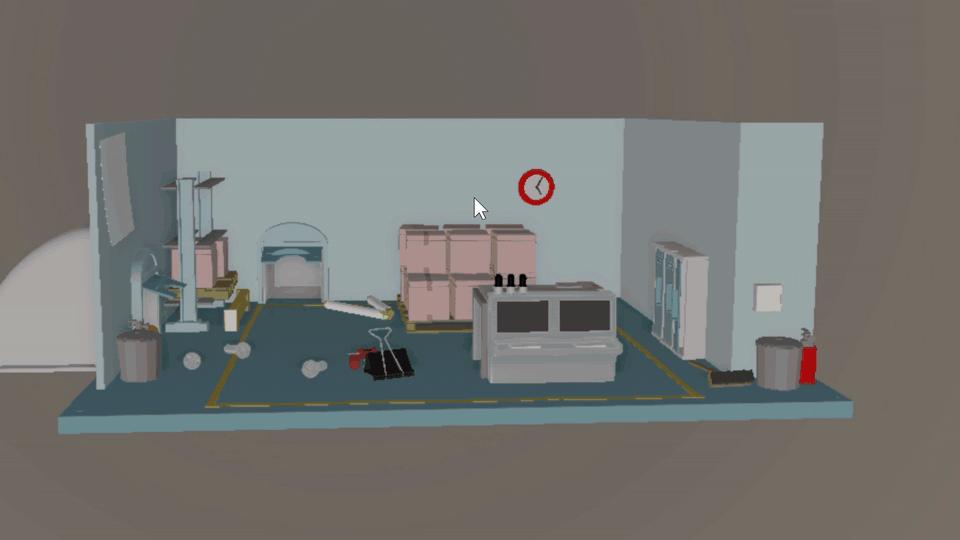

# VulkanRender

A clean C++20 rewrite scaffold for a staged Vulkan renderer. The project is organized around explicit feature profiles so each milestone can be tested independently, including a new realtime ray tracing profile.

## Showcase

## v1.0

**GLB scene loading**


[Open MP4](docs/showcase/v1-glb-loader.mp4)

**Simple material and animation**


[Open MP4](docs/showcase/v1-simple-material-animation.mp4)

**Frustum culling**


[Open MP4](docs/showcase/v1-frustum-culling.mp4)

## v2.0

**Skybox and tone mapping**


[Open MP4](docs/showcase/v2-1.mp4)

**Normal mapping and displacement mapping (parallax occlusion)**


[Open MP4](docs/showcase/v2-2.mp4)

**PBR material and image-based lighting (IBL)**


[Open MP4](docs/showcase/v2-3.mp4)

## v3.0

**Shadow mapping — spot, sphere/point omni, and directional cascade shadows**


[Open MP4](docs/showcase/v3-1.mp4)

## v4.0

**Deferred shading with G-buffer debug views — albedo, normal, depth, SSAO raw, SSAO blur, final composite**



[Open MP4](docs/showcase/v4-1.mp4)

**Many-light deferred composition — 1024 lights, 10000 instanced PBR spheres**


[Open MP4](docs/showcase/v4-2.mp4)

## v6.0

**Bathroom2 — ray-traced shadows, reflections, and SVGF denoising**


[Open MP4](docs/showcase/v6-1.mp4)

**Sponza Palace — hybrid raster + RT, glTF PBR materials, SVGF denoising**


[Open MP4](docs/showcase/v6-2.mp4)

## Course And Reference

The reference project is [YJJfish/Renderer72](https://github.com/YJJfish/Renderer72). Its public README presents four staged versions: scene loading/animation/culling, skybox/PBR/IBL, lights/shadows, and deferred shading/SSAO. The CMU course page you found is [15-472/672/772: Real-Time Computer Graphics, Spring 2024](https://graphics.cs.cmu.edu/courses/15-472-s24/); this repo treats Renderer72 as a functional reference, not as copied source.

## Build

```powershell
scripts\build_msvc.bat
```

`VULKAN_SDK` is optional at configure time. Without it, the app still builds a mock backend and documents why Vulkan probing is unavailable. With the SDK installed, `vulkan_render --list-devices` enumerates local GPUs and checks the Vulkan ray tracing extension set.

If you are already in a clean Visual Studio Developer Prompt, the direct CMake commands also work:

```powershell
cmake --preset nmake-debug
cmake --build --preset nmake-debug
ctest --preset nmake-debug
```

## Run

```powershell
.\build\msvc-debug\src\Debug\vulkan_render.exe --profile v1 --frames 2
.\build\msvc-debug\src\Debug\vulkan_render.exe --profile v6-hybrid --list-devices
build\nmake-debug\src\vulkan_render.exe --profile v2 --render --scene assets\third_party\s72_examples\materials.s72 --output out\v2-materials.bmp --width 1280 --height 720
build\nmake-debug\src\vulkan_render.exe --profile v2 --preview --scene assets\third_party\s72_examples\materials.s72 --width 1280 --height 720
```

Profiles:

- `v1`: scene loading, animation, simple forward shading, frustum culling
- `v2`: skybox, tone mapping, Scene'72 material families, textured lambertian/PBR approximation, and IBL precompute hooks
- `v3`: spot, sphere, and directional light shadow stages
- `v4`: deferred shading, G-buffer, SSAO, many-light composition
- `v6-hybrid`: realtime hybrid ray tracing profile aligned to `.reference/VulkanHybridRenderer`, defaulting to raytraced shadows, raytraced AO, raytraced reflections, and denoising. See `docs/V6_FEATURES.md`

Asset formats:

- Scene'72 `.s72 + .b72` examples are supported by the loader and now use the Vulkan GPU preview path by default.
- Static `.gltf` and `.glb` meshes are supported in the v1 preview path.
- Skinned animation, alpha blending, full glTF PBR texture import, and the real Vulkan PBR shader path are planned for later profiles.

See [docs/ARCHITECTURE.md](docs/ARCHITECTURE.md) and [docs/RENDER_ME.md](docs/RENDER_ME.md).

## Validation Pipeline

Print the Renderer72-aligned per-version validation plan:

```powershell
build\nmake-debug\src\vulkan_render.exe --validation-pipeline
build\nmake-debug\src\vulkan_render.exe --validation-pipeline v4
```

The plan maps local profiles to the public Renderer72 README stages one by one. See [docs/VALIDATION_PIPELINE.md](docs/VALIDATION_PIPELINE.md).
