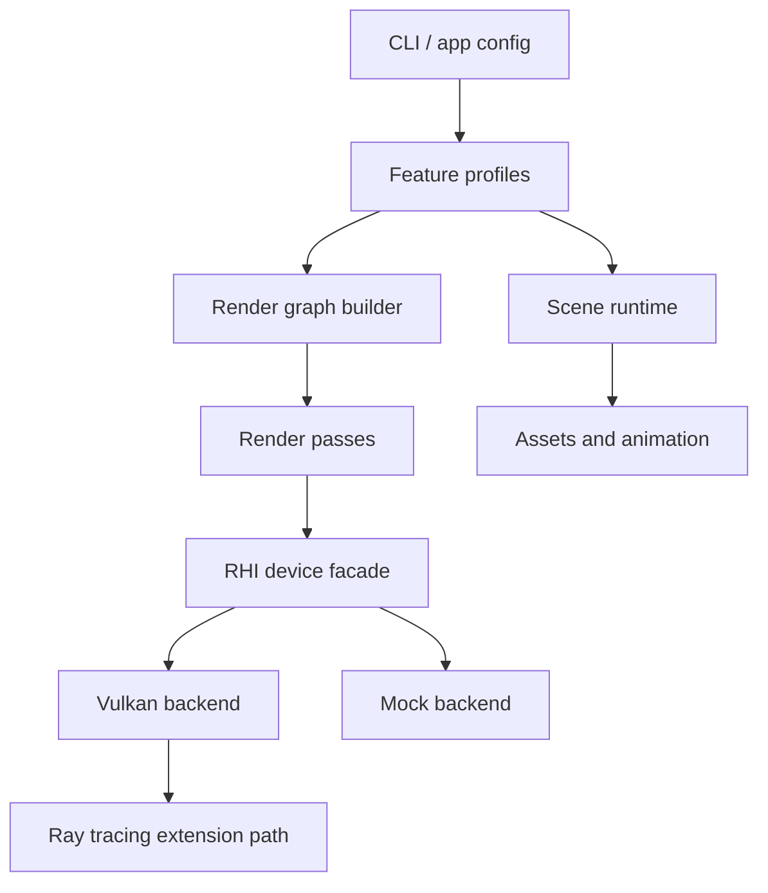

# Architecture

## Goals

This rewrite keeps the staged learning shape of Renderer72 while splitting the engine into small, testable systems. The first usable target is a reliable capability-aware runtime: it can run without a Vulkan SDK, enumerate GPUs when the SDK is present, and make realtime ray tracing an explicit opt-in profile.

## Layers

## Modules

- `platform`: command line parsing and process-facing configuration.
- `core`: profile registry, render graph construction, and application orchestration.
- `rhi`: backend abstraction. The current Vulkan backend performs runtime capability probing; later passes should allocate real resources only through this layer.
- `render`: CPU validation renderer used by v1 and v2 to make each milestone visually testable before the matching Vulkan resources and shaders are complete.
- `rt`: realtime ray tracing concepts are represented as profile and graph stages first, then become concrete BLAS/TLAS and pipeline code behind the RHI.

## Version Profiles

| Profile | Purpose | Primary passes |
| --- | --- | --- |
| `v1` | Loader, animation, culling, simple material | scene upload, animation, culling, forward geometry |
| `v2` | Environment and PBR surface work | IBL precompute, skybox, material shading, tone mapping |
| `v3` | Light and shadow families | shadow atlas, spot light, sphere light, cascaded sun |
| `v4` | Deferred renderer and SSAO | G-buffer, SSAO, deferred light composition |
| `v5-rt` | Realtime ray tracing | BLAS, TLAS, SBT, raygen, miss, closest hit, accumulation |

## v2 Validation Path

The v2 profile now has a concrete software path for the official Scene'72 `materials.s72` asset. It parses material families, normal and UV attributes, PNG albedo/roughness textures, and the Scene'72 environment texture. The render graph still describes the intended Vulkan shape (`environment.ibl-precompute`, `forward.pbr-material`, `skybox.draw`, `post.tone-map`), while the CPU path provides stable output for testing loader semantics and material interpretation.

Current v2 gaps are deliberately documented: the environment lookup is approximate, normal/displacement mapping are not yet shader-evaluated, and glTF PBR texture support is not part of this milestone.

## Realtime Ray Tracing Plan

Realtime ray tracing needs more than a shader toggle. The renderer must select a device with:

- `VK_KHR_acceleration_structure`
- `VK_KHR_ray_tracing_pipeline`
- `VK_KHR_deferred_host_operations`
- `VK_KHR_buffer_device_address`

The v5 graph is built even on unsupported hardware, but execution reports that RT is unavailable unless `--enable-rt` is used on a capable device. This makes CI, documentation, and non-RT laptops useful while keeping the high-end path visible.

## Testing Strategy

- Unit tests validate profile aliases, pass ordering, and RT requirements.
- Smoke runs execute the graph through the mock backend.
- Vulkan smoke tests should stay optional and device-dependent.
- Scene tests should be data-light by default; large assets belong behind explicit download/LFS steps.
