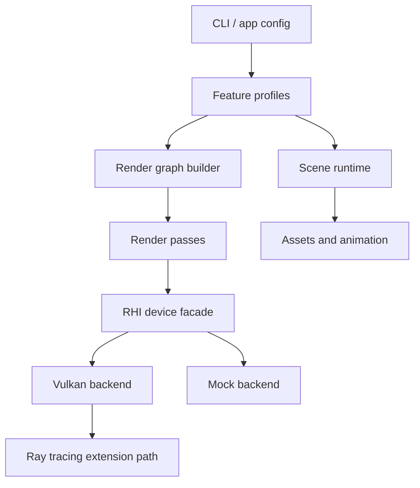

# Architecture

## Goals

This rewrite keeps the staged learning shape of Renderer72 while splitting the engine into small, testable systems. The first usable target is a reliable capability-aware runtime: it can run without a Vulkan SDK, enumerate GPUs when the SDK is present, and make realtime ray tracing an explicit opt-in profile.

## Layers

## Modules

- `platform`: command line parsing and process-facing configuration.
- `core`: profile registry, render graph construction, and application orchestration.
- `rhi`: backend abstraction. The current Vulkan backend performs runtime capability probing; later passes should allocate real resources only through this layer.
- `render`: scene import and fallback CPU validation utilities. The realtime preview path should upload mesh data to GPU buffers instead of rasterizing pixels on the CPU.
- `platform/VulkanPreviewWindow`: native Win32 + Vulkan swapchain preview path with GPU vertex buffers, uniform camera data, depth testing, and roaming camera controls.
- `rt`: realtime ray tracing concepts are represented as profile and graph stages first, then become concrete BLAS/TLAS and pipeline code behind the RHI.

## Version Profiles

| Profile | Purpose | Primary passes |
| --- | --- | --- |
| `v1` | Loader, animation, culling, simple material | scene upload, animation, culling, forward geometry |
| `v2` | Environment and PBR surface work | IBL precompute, skybox, material shading, tone mapping |
| `v3` | Light and shadow families | shadow atlas, spot light, sphere light, cascaded sun |
| `v4` | Deferred renderer and SSAO | G-buffer, SSAO, deferred light composition |
| `v5-rt` | Realtime ray tracing | BLAS, TLAS, SBT, raygen, miss, closest hit, accumulation |

## v2 Validation Path

The v2 profile uses the official Scene'72 `materials.s72` asset as its primary material validation scene. It parses material families, normal/UV/tangent attributes, PNG texture references, and the Scene'72 environment texture. The render graph shape is `environment.ibl-precompute`, `forward.pbr-material`, `skybox.draw`, and `post.tone-map`.

The realtime preview uses a Vulkan GPU path: geometry is imported on the CPU, uploaded to vertex buffers and sampled images, then drawn through a swapchain graphics pipeline with depth, MSAA, material descriptor sets, skybox cubemap sampling, PBR/IBL shading, normal mapping, and POM displacement. The CPU renderer remains useful for BMP regression output and debugging, but it is no longer the intended realtime path.

Current v2 limits are documented in `docs/V2_FEATURES.md`: full glTF PBR texture workflow, glTF animation/skinning, and advanced temporal antialiasing are not part of the v2 alignment target yet.

## Realtime Ray Tracing Plan

Realtime ray tracing needs more than a shader toggle. The renderer must select a device with:

- `VK_KHR_acceleration_structure`
- `VK_KHR_ray_tracing_pipeline`
- `VK_KHR_deferred_host_operations`
- `VK_KHR_buffer_device_address`

The v5 graph is built even on unsupported hardware, but execution reports that RT is unavailable unless `--enable-rt` is used on a capable device. This makes CI, documentation, and non-RT laptops useful while keeping the high-end path visible.

## Testing Strategy

- Unit tests validate profile aliases, pass ordering, and RT requirements.
- Smoke runs execute the graph through the mock backend.
- Vulkan smoke tests should stay optional and device-dependent.
- Scene tests should be data-light by default; large assets belong behind explicit download/LFS steps.
